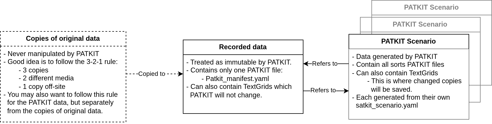

# Data Management

PATKIT aims to support clean, clear, and safe data management. Below you can
find three levels of detail in how to approach this. The more involved models
and guidelines exist to actually get to that clean, clear and safe, but as
convenience often rules, there are simpler ways of analysing data with PATKIT.

## Fastest, simplest way

Just open a directory or data file with PATKIT. If you change any settings save
them and when asked tell PATKIT to put them in the same directory as your data.

## Second fastest, a bit more control

Put the data configuration file `patkit_data.yaml` (what is going to get read)
and the GUI configuration file `patkit_gui.yaml` in the same directory as your
data. If `patkit_data.yaml` has a line specifying `recorded_data_path:` either
make sure it reads `recorded_data_path: .` or just remove the line.

You can copy these files from a previously analysed data set, edit them by hand
(see [Configuration](Configuration.markdown) for description of the options)
and in future versions (time of writing is Patkit v0.22.2) set options in the
PATKIT GUI.

## The full model

The full data management model of PATKIT divides data into three different
kinds of locations. First, as seen in the diagram below, we have the copies of
original data. PATKIT should never be allowed to manipulate or even read these.
Instead, a manual local working copy of recorded data should be created by the
user. This is referred to as Recorded data in the diagram and PATKIT treats it
as -- mostly -- immutable. 



The only files PATKIT will write into or modify in the recorded data
directories is the `patkit_manifest.yaml` file. It is a PATKIT generated list
of all of the scenarios PATKIT has from this set of recorded data and saved
elsewhere.

Finally, PATKIT Scenarios are different data runs specified each in their own
`patkit_data.yaml` files. These files list which derived data should be
generated and which parameters to use in the generation. To save time and
resources, PATKIT will check the scenarios listed in `patkit_manifest.yaml`
files to see if the required data already exists before running the generation
code. If the data exists, then instead of re-generating it PATKIT will just
make a local copy of it in the Scenario directory.

## Copies of original and derived data

A good guide to follow for copies of the original data is the 3-2-1 rule. This
means keeping at least 3 copies, on at least 2 different media (e.g. SSD and
cloud), and 1 copy off-site (in cloud, in another building, or similar). This
protects against data corruption, and against fire and flooding. 

Like mentioned above, the original copies (the 3-2-1 copies) should not be used
as working copies, but rather that will be another copy of the data. They
should be made as needed and deleted when no longer needed. When the derived
data becomes important in its own right, it will make sense to apply the 3-2-1
rule also to the derived data. This might be the case for example when a
publication is based on derived data. 

It is good practice to maintain some sort of note on which scenario, which data
point etc. is the basis of any particular analysis. PATKIT provides support for
this mind set by writing a metadata `.txt` file for each image or other file
exported from PATKIT. It is a good idea to keep these metadata files with the
exported data and images so that when later returning to an old analysis it is
easier to figure out for example which frame of which video this example image
actually is.

## Recommended directory structures

### With current data structures

At time of writing (Patkit v0.22.3), there is just one recommended directory
structure: each Session in its own directory with all recorded files in that
same directory.

As new functionality is implemented this will change and more complex
considerations will become relevant. The next section details how to organise
data once we can process multiple recording session and multiple datasources.

### After data structure update

This section outlines directory structures that will make work easier when
dealing with multiple recording sessions and datasources in the future. The
necessary data structure updates are scheduled in a future version after the
release of Patkit v1.0.

The directory structure of recorded data should reflect the hierarchy of
acquisition. Keep all files of a given recording session from the same data
source (e.g. AAA or RASL or any kind of audio recording) in the same directory
or in the subdirectories of one directory divided by file type. Different data
sources should have their own subdirectories under a session directory. And
session directories of the same experiment series should be gathered in one
directory. This is illustrated below and corresponds to the future core data
structure hierarchy of Dataset-Session-Source-Trial-Modality.


```
dataset
├── patkit_manifest.yaml
├── session_dir_1
├── session_dir_2
├── ...
└── session_dir_n
    ├── patkit_manifest.yaml
    ├── source_dir_1
    ├── source_dir_2
    ├── ...
    └── source_dir_n
        ├── patkit_manifest.yaml
        ├── trial_1.param
        ├── trial_1.txt
        ├── trial_1.ult
        ├── trial_1.wav
        ├── trial_2.param
        ├── trial_2.txt
        ├── trial_2.ult
        ├── trial_2.wav
        ├── ...
        ├── trial_n.param
        ├── trial_n.txt
        ├── trial_n.ult
        └── trial_n.wav
```

In the above example dataset directory contains session directories which
contain source directories and an expanded AAA ultrasound source directory is
shown as an example. While it might be tempting, participants do not get their
own directory level in this scheme. Instead they are inferred from the
metadata. Also, it might feel more natural to have each trial have their own
directory with files from all sources in that directory - or even in
subdirectories - but this would mean an awful lot of copying files around and
runs the risk of accidentally overwriting similarly named files with each
other.

If there is only one data source it is natural to omit the source directory
level from the structure. This is illustrated below. PATKIT will still have a
Source object in each Session to make data structure management simpler.

```
dataset
├── patkit_manifest.yaml
├── session_dir_1
├── session_dir_2
├── ...
└── session_dir_n
    ├── patkit_manifest.yaml
    ├── trial_1.param
    ├── trial_1.txt
    ├── trial_1.ult
    ├── trial_1.wav
    ├── trial_2.param
    ├── trial_2.txt
    ├── trial_2.ult
    ├── trial_2.wav
    ├── ...
    ├── trial_n.param
    ├── trial_n.txt
    ├── trial_n.ult
    └── trial_n.wav
```

It is important to note that PATKIT will place a `patkit_manifest.yaml` on each
level of the hierarchy. This is so that if a Scenario only uses one source from
a single session, only that directory gets a note that there is some derived
data available.

For the PATKIT Scenarios it's possible to use either a flat structure or a full
directory hierarchy. The former works only if the Scenario only consists of a
single Session. The latter can be used also for a single Session and is
essentially necessary for more complex cases to avoid file name conflicts
(having for example to files called File001.PD_l1.meta in the same directory -
which of course won't work). These are illustrated below.

```
dataset
├── patkit_manifest.yaml
├── session_dir_1
├── session_dir_2
├── ...
└── session_dir_n
    ├── patkit_manifest.yaml
    ├── source_dir_1
    ├── source_dir_2
    ├── ...
    └── source_dir_n
        ├── patkit_manifest.yaml
        ├── trial_1.param
        ├── trial_1.txt
        ├── trial_1.ult
        ├── trial_1.wav
        ├── trial_2.param
        ├── trial_2.txt
        ├── trial_2.ult
        ├── trial_2.wav
        ├── ...
        ├── trial_n.param
        ├── trial_n.txt
        ├── trial_n.ult
        └── trial_n.wav
```

## Example data sets

Simple examples of the above cases will be provided eventually as a separate
download. If you have a suitable dataset that could be used as an example and
the ethical conditions permit it being shared publicly, please get in touch.
