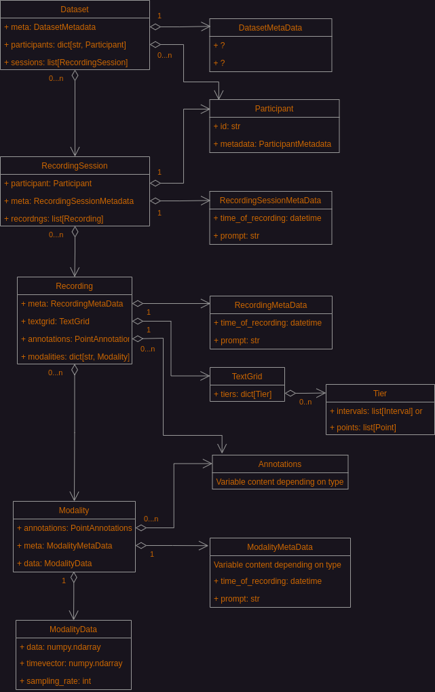

# Future Core Data Structures

*This document describes a plan for the core data structures. It has not yet
been implemented.*

PATKIT has hierarchy of core data structures which take care of representing
files that contain raw or processed data and directories which organise the
data files. The mapping is not exactly one-to-one as some data structures
contain data from multiple files and the hierarchy of data structures is not
necessarily exactly the same as the recommended directory structure (see [Data
management](DataManagement.markdown)).

## Overview of data structures

Dataset is a collection of Sessions -- short for recording session. Sessions
are lists of Trials which are collections of Sources. This is how PATKIT
handles experiments with more than one data source -- say simultaneous
recording of ultrasound and EMA. A Trial is a single synchronised trial which
will have at least one Source. To allow some flexibility, not all Trials in a
Session need to have the same Sources, even if in practice they almost always
will.

Sources consist of Modalities. These are the different, synchronised types of
data recorded by a single program such as AAA recording sound, tongue
ultrasound, and lip video. Finally, Modalities are collections of not only data
but also Annotations of that data.

Representing more than one Participant in a Session or Trial is handled by
having a separate Source(s) for each Participant.

The below UML graph does not show all of the members of the classes, but rather
only the most important ones. For a full description, please refer to the API
documentation and the code itself. For a description of how the different
classes are inherited from abstract base classes see [PATKIT base
classes](base_classes.markdown).

## Structures as Concrete Collections

For ease of use all classes containing a list or a dict of their major
components **are** Python lists and dicts of those components:

* Dataset is a list of Sessions (either Sessions or possibly
  TrialSessions).
* Session is a list of Trials.
  * Session also contains a dictionary of Statistics, but is not a dictionary of
    Statistics in itself.
* Trial is a dictionary of Sources.
* Source is a dictionary of Modalities.
  * Source -- like Session -- also contains a dictionary of Statistics, but is not
    a dictionary of Statistics in itself.
* Modalities are dictionaries of Annotations. This maybe slightly unintuitive,
  since the 'beef' of a Modality is its data. However, accessing the
  Annotations is also important.

Accessing the components in a Pythonic manner is encouraged, but setting them
that way may lead to problems. Use instead accessors like
`Source.add_modality`.

## What Else is Contained: Metadata and Others

Dataset represents a single experiment with possibly multiple Participants and
each with possibly multiple Sessions. While Dataset contains a full dictionary
of all of the participants, the Sessions only have references to the
Participants that took part in the Session.

A Trial represents a single recording in an experiment. It consists of one or
more Sources. A Source represents data from one source -- for example ultrasound
recorded with AAA along with an audio track. The different data types -- both
recorded and derived -- are represented by direct subclasses of Modality.

TrialMetaData contains information on what was recorded and when, but not
redundant information such as what kind of data. In addition, each Trial has
a TextGrid (or rather a PatGrid, see API docs), which is a dict of Tiers which
are lists of either Intervals or Points.

Besides being a dictionary of Annotations, each Modality contains metadata --
both general and specific to the type of Modality -- and the actual data of the
Modality along with its timevector. These are primarily wrapped as a
ModalityData object but also available as `Modality.data, Modality.timevector`
and `Modality.timeoffset` for convenience.

The data field in ModalityData has a standardised axes order so that algorithms
will work on unseen data. The general order is [time, coordinate axes and
data types, data points] and further structure. For example stereo audio data
would be [time, channels] or just [time] for mono audio. For a more complex
example, splines from AAA have [time, x-y-confidence, spline points] or [time,
r-phi-confidence, spline points] for data in polar coordinates.

A special kind of data is represented by Statistic, which can be contained (in
dictionaries) by Dataset, Session, Trial, or Source. Statistics represent time
invariant derived data such as an average over a Trial.

## Base classes

There are some abstract base classes which all of the core data structures
inherit from. These are described in [Base classes](base_classes.markdown).